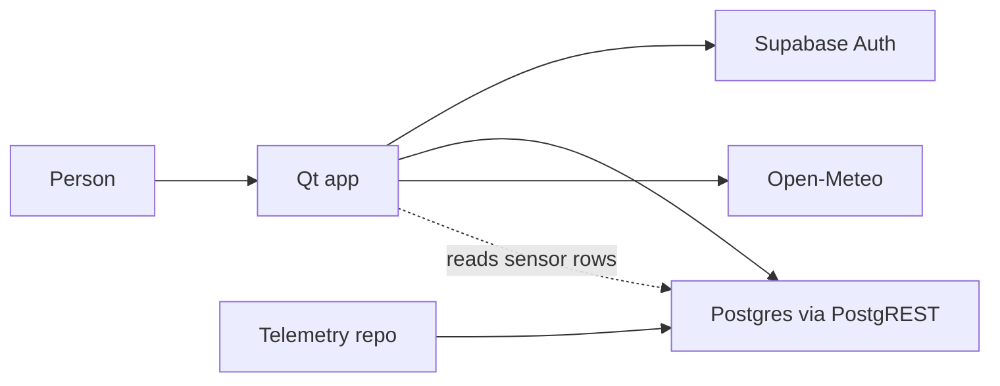
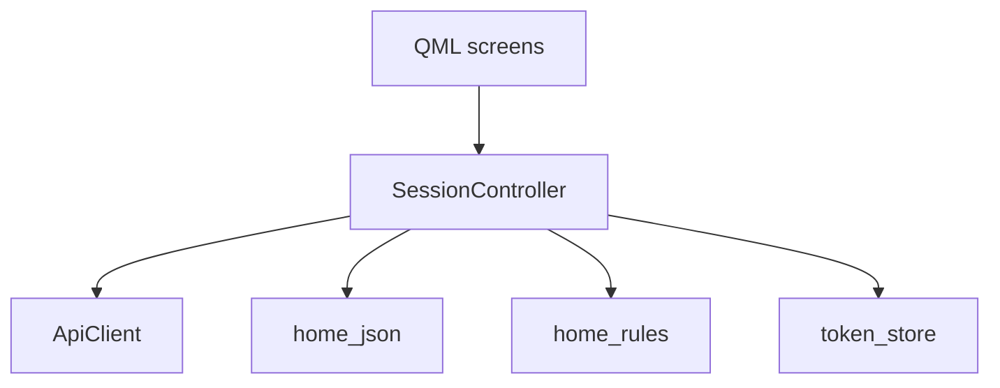
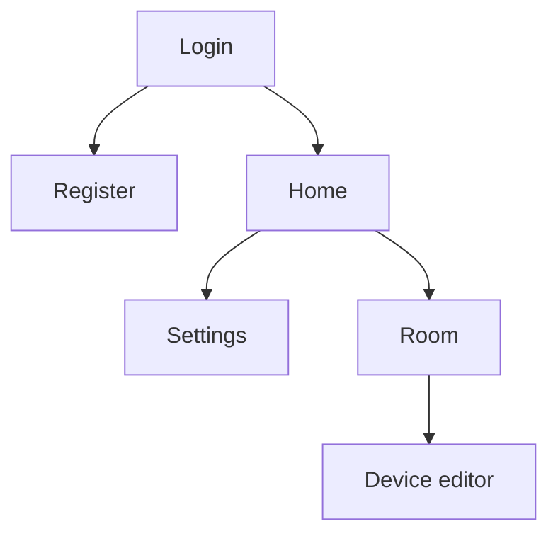
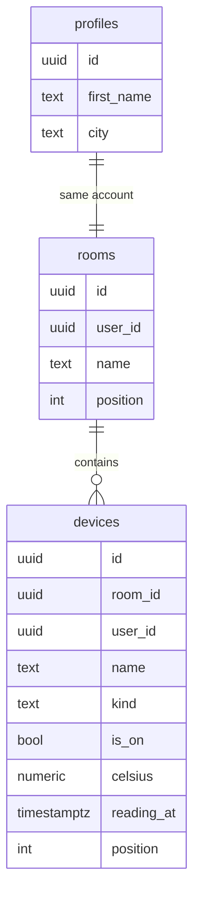
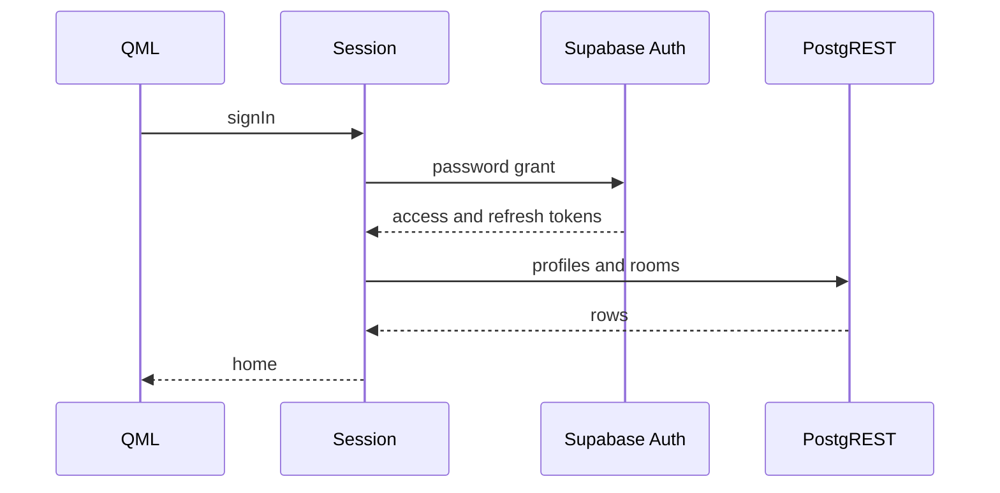

# Architecture

This page describes the running client. Rules and limits are in `AGENTS.md`. How to build is in `README.md`.

## Context

The Qt app is the only process in this repo. Supabase holds the account and the home rows. Open-Meteo answers weather. Another repository writes sensor telemetry into the same cloud. Its name and tables are unknown, so this diagram does not invent them.

The access token stays in memory. The refresh token is the only session secret on disk: `session.bin` under the app data directory, sealed with DPAPI on Windows and plaintext in the app-private directory on Android.

## Client

QML draws the screens and calls `SessionController`. The controller does not parse HTTP bodies itself. `ApiClient` performs the requests. `home_json` parses them. `home_rules` checks names, passwords, email, city, and the greeting band.

`smarthome_core` is the static library of rules, JSON, and the token file, so the tests link those without the GUI. `ApiClient` and `SessionController` belong to the QML module.

## Screens

`Main.qml` keeps one `StackView`. Sign-in replaces the stack with Home. Logout replaces it with Login. The other screens are pushed.

Home reloads when it opens, after a successful change, and every 20 seconds while the app is active. A hidden app sends no data requests.

## Data

One account owns its profile, rooms, and devices. Deleting a room deletes its devices. A light or plug stores `is_on`. A thermometer stores `celsius` and `reading_at` and has no switch.

The picture groups profile and rooms by account. It is not a foreign key from `rooms` to `profiles`. The SQL foreign keys are `profiles.id`, `rooms.user_id`, and `devices.user_id` to `auth.users`, and `devices.room_id` to `rooms`.

`kind` is `light`, `plug`, or `thermometer`. Row level security limits every row to `auth.uid()`.

This app writes rooms, device names, and the desired on/off value. It reads `celsius` and `reading_at`. The telemetry repository is the writer for those two columns. `walkStaleReadings` still writes a fake temperature. That call is leftover and is not part of this architecture.

## Sign-in

Signup and password login both return a session. The client stores the refresh token, then loads the profile and the rooms. A later call refreshes once if the access token expires within 60 seconds, or once after a 401.

Weather never uses that path. A city change calls Open-Meteo geocoding, then the forecast. A failed forecast keeps the last line from this session.
