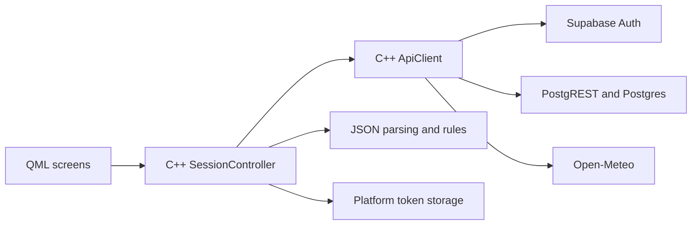

# Architecture

This is an explanatory reference, not agent policy. [AGENTS.md](../AGENTS.md) contains coding-agent instructions; [README.md](../README.md) describes the current build and setup.

## Product Direction

The approved goal is a Qt/QML and C++ client for one person controlling real devices from multiple clients, including remote access. Windows and Android are the first release targets; Linux, macOS and iOS remain future targets until validated.

There should be no recurring cloud subscription. Equipment, an always-on host, power, distribution and licensing may still have costs. Free service quotas are not an availability guarantee.

Hardware, protocols, backend and account model have not been selected. The current prototype does not establish those choices or prove a working hardware integration.

## Current Prototype

- [main.cpp](../main.cpp) loads `SmartHome/Main`; [CMakeLists.txt](../CMakeLists.txt) registers [Main.qml](../Main.qml) as that entrypoint.
- [SessionController](../src/app/session_controller.cpp) coordinates accounts, profile, room/device mutations, weather and polling. [ApiClient](../src/app/api_client.cpp) implements the HTTP requests.
- Device switches patch `devices.is_on`. There is no implemented device adapter, command-delivery path or physical acknowledgement; an affected database row is not physical confirmation.
- Thermometers are simulated: creation supplies a value and timestamp, and room responses can trigger random replacement readings. Inactive state stops future periodic polling, but in-flight work can still finish. These values are not real telemetry.
- [The schema](../supabase/migrations/0001_home.sql) owns prototype profiles, rooms and devices. Its thermometer constraints model simulation, not a validated sensor contract. [The upgrade migration](../supabase/migrations/0002_thermometer_celsius_not_null.sql) rejects existing null values for explicit remediation.
- Access tokens stay in memory. [Token storage](../src/app/token_store.cpp) uses atomic file replacement, Windows DPAPI and Android Keystore-backed encryption; other platforms reject persistence and ignore stored tokens until secure storage is implemented. See [security](security.md) for the session and migration limitations.
- Refresh is single-flight and authorized retries are bounded. Transient refresh failures preserve the session; definitive refresh rejection, malformed refresh success or failure to persist tokens during refresh cancels pending requests and clears local auth state.
- Request identity, stale-response checks and same-resource serialization protect client state. These protections do not establish live backend authorization or hardware behavior.

The five [test suites](../tests) cover rules, parsing, token storage, HTTP contracts and controller lifecycle/mutation behavior. They include deferred-response and retry coverage, but do not validate a live project's access policies or real devices. App and platform versions are derived from the CMake project rather than maintained separately.

## Integration Options

No option has been selected or given preference. The comparison depends on representative devices, remote reachability and operating ownership, not on the prototype's vendor choices.

| Option | Potential simplification | Evidence needed |
| --- | --- | --- |
| Existing hub | Reuse device adapters, identity and authoritative state instead of duplicating them | Device compatibility, reported-state guarantees, host requirements and secure remote access |
| Vendor API | Reuse the device vendor's supported control and telemetry contract | Supported models, credentials, subscription terms, API access and outage behavior |
| Custom gateway | Implement only the protocol needed by actual custom devices | Protocol, command acknowledgement, device identity, telemetry provenance and hosting/maintenance costs |

A database alone does not deliver commands to devices. Separate app accounts, persistence, brokers and custom adapters are justified only if the selected integration requires them.

## Proposed Minimal Client

The proposed first version connects to one selected authority, lists rooms/areas and devices, sends explicit on/off commands, and displays reported state and timestamped sensor readings. Connection settings, disconnect, pending/error/offline states and reconnect reconciliation are part of that workflow.

Weather, separate registration/profile features and application-owned room/device management are candidates for retirement, not approved removals. A hub may already own those resources. Histories, scenes, schedules, household sharing, multiple integrations and offline command queues are outside this proposed first version.

The UI separates command acceptance, device-reported state and physical confirmation. A hub can report an optimistic state; the display must reflect the integration's actual guarantees. Measurements retain source, units, observation time and unknown/stale states rather than inventing replacements.

## Selection and Validation

1. Select a representative switchable device and sensor, and compare the three integration routes against their actual contracts and total costs.
2. Test control and readings locally and remotely, including wrong-user access, credential expiry/revocation, disconnected devices, timeout and duplicate/out-of-order responses.
3. Verify telemetry provenance and freshness, and reconcile an authoritative snapshot after reconnect. A service acknowledgement or mock test cannot prove physical action.
4. Obtain approval for the integration, account model, remote-access route and feature retirements before replacing production paths or designing new persistence.

Until that evidence exists, the hardware/backend decision remains open. Existing workflows and applied migration history are preserved; disposable prototype data is not permission to delete remote resources or local builds.
