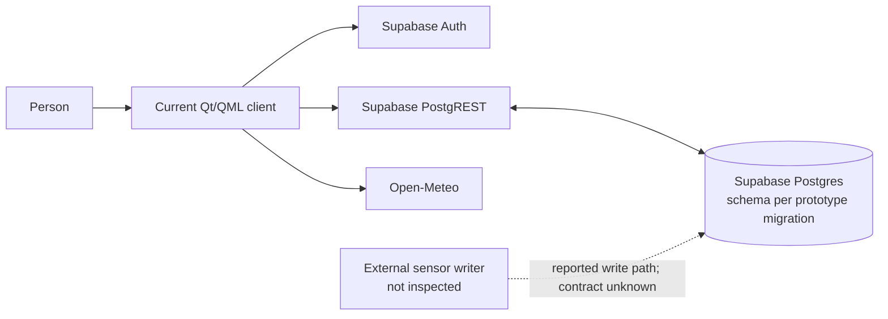
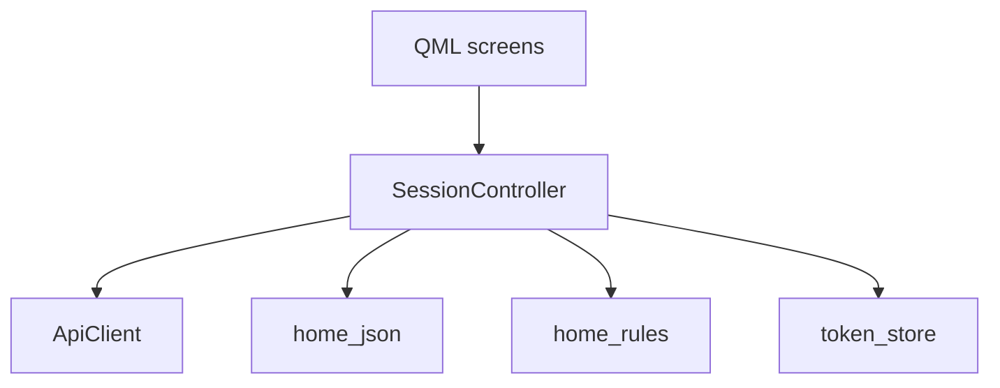
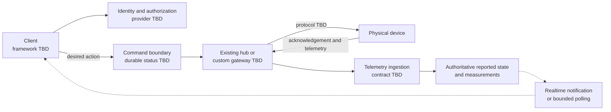

# Architecture Status

This repository is being rebuilt from a prototype. The current implementation is documented as observed behavior; the target design below is a candidate, not an approved system specification. See [AGENTS.md](../AGENTS.md) for rebuild constraints and [README.md](../README.md) for the current build baseline.

## Observed Prototype

The current client is Qt 6 / QML with a C++ session controller and HTTP client. It calls Supabase Auth and PostgREST, and Open-Meteo for weather. The bootstrap and numbered upgrade migrations describe `profiles`, `rooms`, and `devices`; the schema has not been validated against real devices or the external telemetry producer.

The client can write `devices.is_on`, but this repository contains no command broker, device adapter, gateway, or acknowledgement path. A successful database write therefore does not establish that a physical device changed state. The external sensor writer is user-reported; its repository, payload, credentials, and destination schema remain unknown.

The client stores an access token in memory and a refresh token in its platform-specific session file. Writes use atomic file replacement. Windows protects the token with DPAPI; Android encrypts it with AES-GCM using a key held in Android Keystore. A token persistence failure prevents adopting the incoming token pair; during refresh, it clears local auth state rather than continue with an unpersisted rotated token. Transport, HTTP 408, 429, and 5xx refresh failures preserve the session and queued authorized requests for retry on the 15-second timer. Definitive refresh rejection or a malformed successful response clears local session state and pending/retry-queued requests so they cannot replay after another sign-in.

The app version is `1.0.0`, defined once by the top-level CMake project and propagated to `QCoreApplication`, platform bundle metadata, and Android version name/code. Android package ID is `org.mutuma.smarthome`.

## Current Client Shape

`main.cpp` loads `SmartHome/Main`; CMake aliases `AccountMain.qml` to that module entrypoint. The root `Main.qml` and the prototype widgets not referenced by the active module are legacy sources. `SessionController` coordinates authentication, refresh, room/device state, weather, and mutation callbacks. This boundary describes the current implementation, not a required shape for future hardware integration. The five CTest targets cover core rules, JSON parsing, token storage, API-client request behavior, and session-controller refresh, persistence, polling, and mutation-result behavior. No test proves backend authorization against a live project or physical-device action.

## Confirmed Gaps

- Device toggles patch a row directly. There is no observed path to hardware, command identity, device acknowledgement, or reported-state reconciliation.
- Thermometers are simulated by the client, not by an observed physical sensor writer. New thermometers start at 22.0°C; while signed in and active, polling writes a bounded replacement when `reading_at` is null or at least 15 minutes old. This is not evidence of physical measurement or external telemetry.
- The client can create thermometers with a non-null Celsius value and timestamp. The schema permits `reading_at` to be null for an existing thermometer; the parser keeps such rows visible so the stale-reading path can repair them. The numbered upgrade migration rejects existing null-Celsius rows for explicit remediation rather than inventing values.
- The schema constrains thermometer values and grants access using the current user-token model. RLS, household sharing, and the external writer's requirements have not been validated against a live Supabase project.
- The app polls every 20 seconds only while signed in and active. Inactive state stops future polling, but does not cancel requests already in flight. There is no demonstrated live command delivery or reconnect protocol.
- Per-request retry identity, sign-out cancellation, and mutation-result handling prevent known stale-response, cross-account replay, late-reply, and premature-dismissal cases. A successful database write still does not prove that a physical device acted.
- Room and device mutations only report success when PostgREST returns an affected row; delete requests ask for the deleted row ID. Profile updates validate their returned profile row.

These are review findings against the current app. Fixes that depend on the actual telemetry or hardware contract must wait for that contract rather than guessing new columns or policies.

## Candidate Target Pattern

For custom devices, a candidate command path is an authenticated client, a server-side authorization/command boundary, and a gateway or adapter that speaks the device protocol. If Home Assistant already supports the actual devices, evaluate it as the integration boundary before building custom adapters. MQTT is an option for custom gateways, not a decision for this project.

The UI should distinguish a requested state from device-reported state. A command may be shown as pending until acknowledged, and should expose timeout/failure rather than claiming success after a database write. Realtime delivery, if selected, should notify the client to reconcile with authoritative state after reconnect; notifications alone are not durable state.

## Decision Gates

| Decision | Evidence needed before implementation |
| --- | --- |
| Client framework and launch platforms | Required OSes, native capabilities, packaging, team/tooling constraints |
| Device integration | Device models, existing hub, protocol, command and acknowledgement behavior |
| Telemetry | Writer source, payload, identity, units, timestamps, cadence, retention, authorization |
| Backend | Hosting/cost limits, household authorization, operational ownership, migration and backup needs |
| Offline behavior | Whether commands may queue, expiry semantics, reconnect reconciliation, stale-data display |
| Security model | Account/household membership, device credentials, revocation, audit and threat boundaries |

## Required Validation Path

Before committing to hardware or external telemetry changes, simulate one device and test one representative real integration. Verify authorization, command expiry and duplicate handling, device acknowledgement, offline/reconnect behavior, telemetry provenance, and state freshness. Design persistence only from the observed contract. Do not treat the current migrations as validation of the hardware or external-writer contract.
