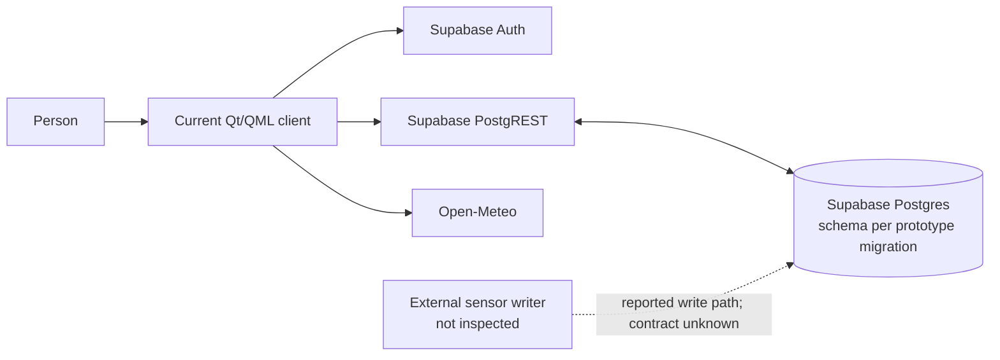
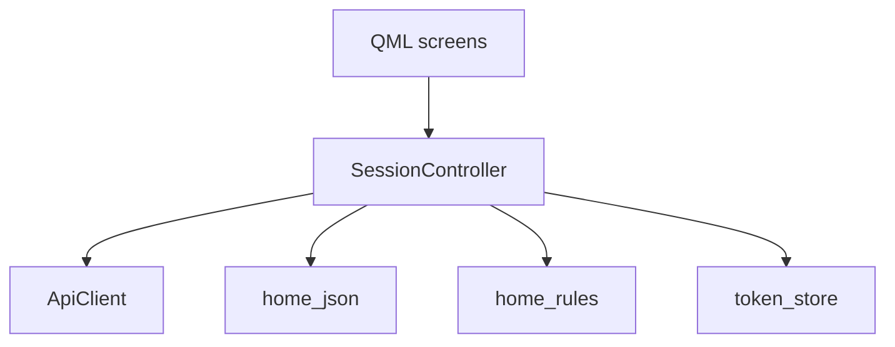
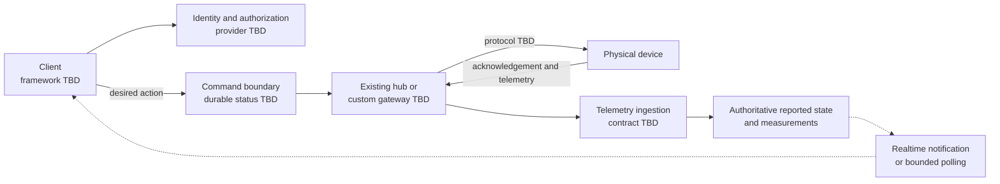

# Architecture Status

This repository is being rebuilt from a prototype. The current implementation is documented as observed behavior; the target design below is a candidate, not an approved system specification. See [AGENTS.md](../AGENTS.md) for rebuild constraints and [README.md](../README.md) for the current build baseline.

## Observed Prototype

The current client is Qt 6 / QML with a C++ session controller and HTTP client. It calls Supabase Auth and PostgREST, and Open-Meteo for weather. The current migration describes `profiles`, `rooms`, and `devices`, but those tables and constraints have not been validated against real devices or the external telemetry producer.

The client can write `devices.is_on`, but this repository contains no command broker, device adapter, gateway, or acknowledgement path. A successful database write therefore does not establish that a physical device changed state. The external sensor writer is user-reported; its repository, payload, credentials, and destination schema remain unknown.

The client stores an access token in memory and a refresh token in its platform-specific session file. The Android storage is app-private but not encrypted by the current token store. Review platform secure-storage options before treating session persistence as production-ready.

## Current Client Shape

`SessionController` currently coordinates authentication, refresh, room/device state, weather, and mutation callbacks. This is a prototype boundary, not a required shape for the rebuild. Existing tests cover core rules, JSON parsing, and token storage; backend/controller behavior and physical-device interaction are not covered by automated tests.

## Confirmed Gaps

- Device toggles patch a row directly. There is no observed path to hardware, command identity, device acknowledgement, or reported-state reconciliation.
- The previous client seeded `22.0` and randomly changed stale readings. That writer is removed; existing saved sensor rows remain display-only while the telemetry contract is unknown.
- New sensor creation is disabled in the client because the provisional migration requires a reading at insert time. The migration is not changed or treated as the target schema.
- The migration constrains thermometer values and grants access based on the current user-token model. Neither rule is confirmed for the external writer or intended household sharing.
- The app polls while active. There is no demonstrated live command delivery or reconnect protocol.
- Shared retry state and callbacks that outlive sign-out can create stale or cross-request behavior. Mutation screens can dismiss before the service confirms success.

These are review findings against the prototype. Fixes that depend on the actual telemetry or hardware contract must wait for that contract rather than guessing new columns or policies.

## Candidate Target Pattern

For custom devices, a candidate command path is an authenticated client, a server-side authorization/command boundary, and a gateway or adapter that speaks the device protocol. If Home Assistant already supports the actual devices, evaluate it as the integration boundary before building custom adapters. MQTT is an option for custom gateways, not a decision for this project.

The UI should distinguish a requested state from device-reported state. A command may be shown as pending until acknowledged, and should expose timeout/failure rather than claiming success after a database write. Realtime delivery, if selected, should notify the client to reconcile with authoritative state after reconnect; notifications alone are not durable state.

## Decision Gates

| Decision | Evidence needed before implementation |
| --- | --- |
| Client framework and launch platforms | Required OSes, native capabilities, packaging, team/tooling constraints |
| Device integration | Device models, existing hub, protocol, command and acknowledgement behavior |
| Telemetry | Writer source, payload, identity, units, timestamps, cadence, retention, authorization |
| Backend | Hosting/cost limits, household authorization, operational ownership, migration and backup needs |
| Offline behavior | Whether commands may queue, expiry semantics, reconnect reconciliation, stale-data display |
| Security model | Account/household membership, device credentials, revocation, audit and threat boundaries |

## Required Validation Path

Before committing to schema or framework decisions, simulate one device and test one representative real integration. Verify authorization, command expiry and duplicate handling, device acknowledgement, offline/reconnect behavior, telemetry provenance, and state freshness. Design persistence only from the observed contract. Keep the current migration as prototype input; do not apply it to a real project as a validated schema.
